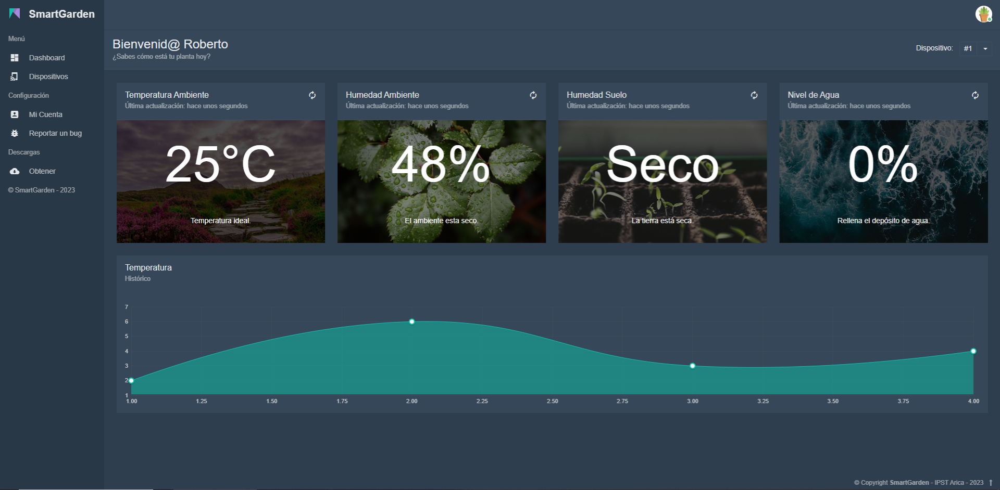

# SmartGarden: Prototipo de IoT para Monitoreo y Automatización de Riego para Plantas de Hogar

Este repositorio de GitHub contiene el código fuente y la documentación para un sistema de IoT (Internet de las cosas) diseñado para monitorear y automatizar el riego de plantas de hogar.

## Funcionalidades principales
* Monitoreo en tiempo real: El sistema permite monitorear el estado de tus plantas en tiempo real. Puedes verificar la humedad del suelo, la temperatura ambiente y la humedad relativa desde cualquier lugar.
* Automatización del riego: Configura reglas de riego basadas en la humedad del suelo y otros parámetros. El sistema puede activar o desactivar automáticamente la irrigación de tus plantas cuando sea necesario.
* Registro de datos: El sistema almacena datos históricos que te permiten analizar el rendimiento y la evolución de tus plantas con el tiempo.

## Componentes del sistema
### El sistema consta de los siguientes componentes:
* Dispositivo de medición: Utiliza sensores de humedad del suelo, temperatura y humedad para recopilar datos sobre el entorno de tus plantas.
* Controlador de riego: Este dispositivo controla la activación de la irrigación según las reglas que hayas configurado.
* Broker MQTT: Almacena los datos recopilados, gestiona las reglas de riego y envía notificaciones y alertas.

## Configuración del repositorio
### Estructura del directorio
* /docs: Contiene documentación detallada sobre el sistema, incluyendo instrucciones de instalación y configuración.
* /src: Aquí encontrarás el código fuente del microcontrolador NodeMCU en C++.
* /web: Aquí encontrarás el código fuente de la página web en JAVA.
* /hardware: Información sobre los componentes de hardware utilizados en el proyecto, incluyendo esquemas y especificaciones.
* /broker: Código y configuración del servidor Ubuntu Server y el broker MQTT EMQX.

## Requisitos de hardware y software
En la documentación, encontrarás información detallada sobre los requisitos de hardware y software para cada componente del sistema.

## Instrucciones de uso
Las instrucciones detalladas para configurar y utilizar el sistema se encuentran en la documentación en /docs.

## Licencia
Este proyecto se encuentra bajo la licencia MIT, lo que significa que puedes utilizar, modificar y distribuir el código de acuerdo con los términos de dicha licencia.

## Contacto
Si tienes preguntas, sugerencias o comentarios, puedes contactarme mediante correo electrónico a robertoignaciovargas@gmail.com.
¡Espero que este sistema de IoT te ayude como inspiración o guía en tus futuros proyectos!
