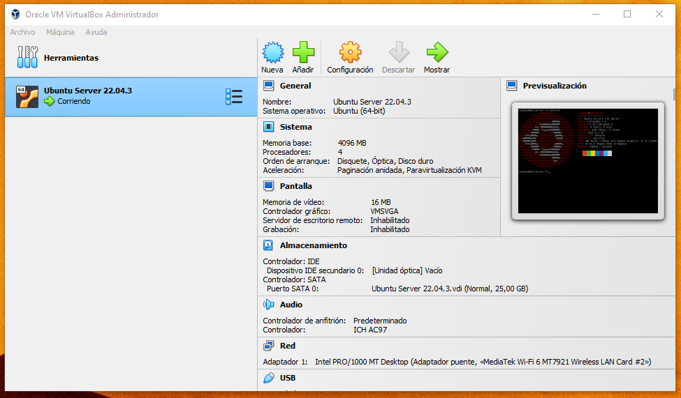
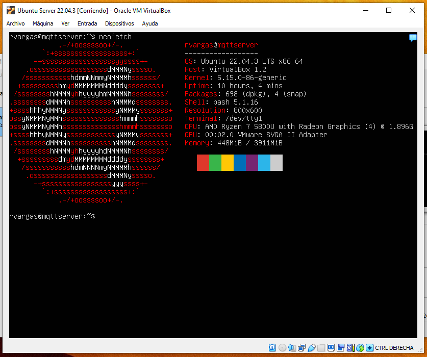

# Guía paso a paso para instalar Ubuntu Server en VirtualBox

Esta guía te llevará a través de los pasos para instalar Ubuntu Server en una máquina virtual utilizando VirtualBox.

## Paso 1: Descargar los archivos de instalación

1. Descarga VirtualBox desde [https://www.virtualbox.org](https://www.virtualbox.org/) e instálalo en tu sistema.

2. Descarga la imagen ISO de Ubuntu Server desde [ubuntu.com/download/server](https://ubuntu.com/download/server).

## Paso 2: Crear una nueva máquina virtual

1. Abre VirtualBox y haz clic en "Nuevo" para crear una nueva máquina virtual.

2. Asigna un nombre a tu máquina virtual y selecciona "Linux" como tipo y "Ubuntu (64-bit)" como versión del sistema operativo.

3. Asigna la cantidad de memoria RAM que deseas para la máquina virtual. Se recomiendan al menos 1 GB.

4. Crea un nuevo disco duro virtual o utiliza uno existente si ya tienes uno configurado.

5. Asegúrate de asignar suficiente espacio de almacenamiento (al menos 20 GB) para la máquina virtual.

## Paso 3: Configurar la máquina virtual

1. Selecciona la máquina virtual recién creada en VirtualBox y haz clic en "Configuración".

2. En la pestaña "Almacenamiento", selecciona el controlador de CD/DVD y monta la imagen ISO de Ubuntu Server que descargaste en el Paso 1.

3. En la pestaña "Red", asegúrate de que esté configurada como "Adaptador puente".

## Paso 4: Iniciar la máquina virtual

1. Haz clic en "Iniciar" para iniciar la máquina virtual.

2. La máquina virtual arrancará desde la imagen ISO de Ubuntu Server.

## Paso 5: Instalación de Ubuntu Server

1. Selecciona "Instalar Ubuntu Server" en el menú de inicio.

2. Sigue los mismos pasos que se describen en la guía anterior (Pasos 5 a 12) para instalar Ubuntu Server en la máquina virtual.

## Paso 6: Finalizar la instalación

1. Una vez que la instalación esté completa, reinicia la máquina virtual.

2. Inicia sesión en Ubuntu Server con el nombre de usuario y contraseña que configuraste durante la instalación.

¡Felicidades! Ahora tienes Ubuntu Server instalado en una máquina virtual en VirtualBox. Puedes ir al paso 2, instalar el Broker MQTT.

