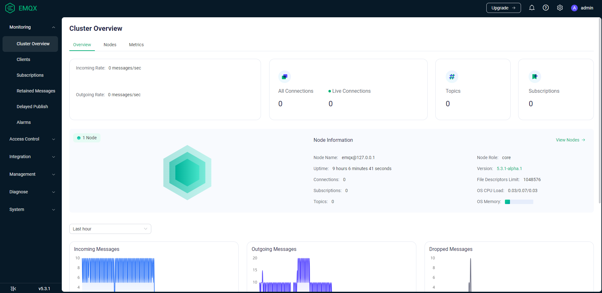
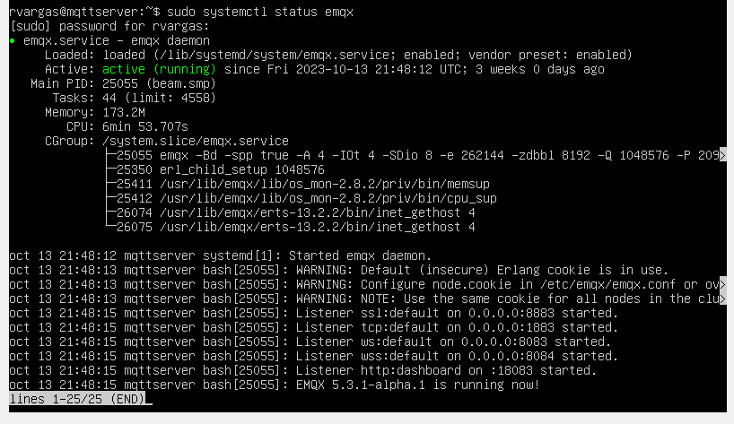

# Instalación de EMQX en Ubuntu Server


A continuación, se describen los pasos para instalar EMQX (un servidor MQTT) en un sistema Ubuntu Server. Esto desde la consola o terminal (debes tener la contraseña de super usuario).

## Paso 1: Actualizar el sistema
Asegúrate de que tu sistema esté actualizado ejecutando los siguientes comandos:

```
sudo apt update
```
```
sudo apt upgrade
```

## Paso 2: Descargar recurso
La forma más rápida para instalar EMQX es mediante APT Source. Ejecuta el siguiente comando:

```
curl -s https://assets.emqx.com/scripts/install-emqx-deb.sh | sudo bash
```

## Paso 3: Instalar EMQX
Ahora debemos instalar el paquete descargado. Ejecutando el siguiente comando:

```
sudo apt-get install emqx
```

## Paso 4: Iniciar EMQX
Inicia el servicio EMQX:

```
sudo systemctl start emqx
```

## Paso 5: Habilitar el servicio EMQX
Habilita el servicio EMQX para que se inicie automáticamente con el sistema:

```
sudo systemctl enable emqx
```


## Paso 6: Comprobar el estado de EMQX
Puedes verificar si EMQX se está ejecutando correctamente ejecutando:

```
sudo systemctl status emqx
```

Deberías ver una salida que indica que el servicio está en ejecución.



EMQX ahora está instalado y en funcionamiento en tu servidor Ubuntu. Puedes configurarlo y administrarlo según tus necesidades.
Recuerda que para acceder se utiliza el la ip del host y el puerto 18083.
